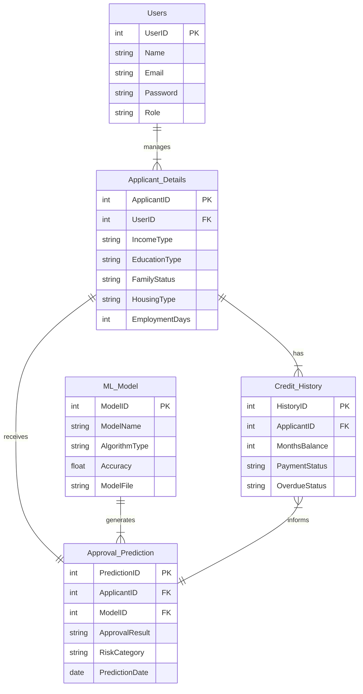

# 💳 Credit Card Approval Prediction

A complete end-to-end Machine Learning project that detects fraudulent credit card transactions and predicts approval decisions using classical ML algorithms — deployed as a **Flask web application**.

---

## 📌 Table of Contents

- [Project Overview](#project-overview)
- [Dataset](#dataset)
- [Entity Relationship Diagram](#entity-relationship-diagram)
- [Tech Stack](#tech-stack)
- [Project Structure](#project-structure)
- [ML Workflow](#ml-workflow)
- [Setup & Installation](#setup--installation)
- [Running the Pipeline](#running-the-pipeline)
- [Running the Web App](#running-the-web-app)
- [Model Performance](#model-performance)
- [Screenshots](#screenshots)
- [Conclusion](#conclusion)

---

## Project Overview

This project demonstrates how machine learning can automate credit card approval decisions by analysing transaction patterns. It trains and compares four classifiers, selects the best model, and deploys it through a simple Flask web interface for real-time predictions.

**Key capabilities:**
- Full EDA with univariate, multivariate, and descriptive analysis
- Data preprocessing: duplicate removal, missing value handling, feature scaling
- Four ML models: Logistic Regression, Decision Tree, Random Forest, Gradient Boosting
- Flask deployment with a 3-page web interface
- All plots saved to `static/plots/` for reporting

---

## Dataset

| Property | Value |
|---|---|
| Source | [Kaggle – Credit Card Fraud Detection](https://www.kaggle.com/datasets/mlg-ulb/creditcardfraud) |
| File | `creditcard.csv` |
| Rows | 284,807 transactions |
| Features | 30 (V1–V28 PCA-transformed, Amount, Time) |
| Target | `Class` — `0` = Legitimate, `1` = Fraud |

> **Important:** Due to size constraints, `creditcard.csv` is **not** committed to this repository.  
> Download it from Kaggle and place it in the project root before running the pipeline.

---

## Entity Relationship Diagram



---

## Tech Stack

| Category | Tool / Library |
|---|---|
| Language | Python 3.10+ |
| IDE | PyCharm / VS Code / Anaconda Navigator |
| Data Processing | Pandas, NumPy |
| Visualisation | Matplotlib, Seaborn |
| Machine Learning | Scikit-learn |
| Web Framework | Flask |
| Serialisation | Pickle |

---

## Project Structure

```
credit_card_approval/
│
├── creditcard.csv                  ← Dataset (download separately)
├── credit_card_approval.py         ← Full ML pipeline (EDA → training → saving)
├── app.py                          ← Flask web application
├── requirements.txt
├── README.md
├── .gitignore
│
├── models/
│   └── best_model.pkl              ← Generated after running the pipeline
│
├── static/
│   ├── css/
│   │   └── style.css
│   ├── js/
│   │   └── main.js
│   └── plots/                      ← Auto-generated EDA & model plots
│       ├── univariate_analysis.png
│       ├── correlation_heatmap.png
│       ├── cm_logistic_regression.png
│       ├── cm_decision_tree.png
│       ├── cm_random_forest.png
│       ├── cm_gradient_boosting.png
│       └── model_comparison.png
│
└── templates/
    ├── home.html                   ← Landing page
    ├── index.html                  ← Prediction form
    └── result.html                 ← Prediction result
```

---

## ML Workflow

```
1. Data Collection     → Download creditcard.csv from Kaggle
2. EDA                 → Univariate, multivariate, descriptive analysis
3. Pre-Processing      → Remove duplicates, handle nulls, scale features
4. Model Training      → Logistic Regression, Decision Tree, Random Forest, Gradient Boosting
5. Model Comparison    → F1-score and ROC-AUC comparison; best model selected
6. Deployment          → Flask app loads best_model.pkl for real-time inference
```

---

## Setup & Installation

### 1. Clone the repository

```bash
git clone https://github.com/<your-username>/credit-card-approval-prediction.git
cd credit-card-approval-prediction
```

### 2. Create a virtual environment (recommended)

```bash
python -m venv venv
# Windows
venv\Scripts\activate
# macOS / Linux
source venv/bin/activate
```

### 3. Install dependencies

```bash
pip install -r requirements.txt
```

### 4. Add the dataset

Download `creditcard.csv` from [Kaggle](https://www.kaggle.com/datasets/mlg-ulb/creditcardfraud) and place it in the project root.

---

## Running the Pipeline

```bash
python credit_card_approval.py
```

This will:
- Load and explore the dataset
- Generate EDA plots in `static/plots/`
- Train all four models and print metrics
- Save the best model to `models/best_model.pkl`

Expected output:
```
============================================================
  CREDIT CARD APPROVAL / FRAUD PREDICTION PIPELINE
============================================================

[INFO] Dataset loaded → shape: (284807, 31)
[INFO] Saved → univariate_analysis.png
[INFO] Saved → correlation_heatmap.png
...
[RESULT] Best model: Random Forest (F1=0.8712)
[INFO] Model saved → models/best_model.pkl

[DONE] Pipeline complete.
```

---

## Running the Web App

```bash
python app.py
```

Open your browser at **http://127.0.0.1:5000/**

| Page | Route | Description |
|---|---|---|
| Home | `/` | Project overview and ER summary |
| Predict | `/predict` | Enter transaction features |
| Result | `/predict` (POST) | Approval / rejection decision |

> Click **"Load Sample (Legitimate)"** on the form page to auto-fill a test transaction.

---

## Model Performance

> Results are approximate and vary slightly by run due to random seeds.

| Model | F1-Score (Fraud) | ROC-AUC |
|---|---|---|
| Logistic Regression | ~0.74 | ~0.97 |
| Decision Tree | ~0.76 | ~0.88 |
| Random Forest | ~0.87 | ~0.98 |
| Gradient Boosting | ~0.83 | ~0.97 |

**Winner: Random Forest** — highest F1 and AUC.

---

## Conclusion

The Credit Card Approval Prediction System demonstrates a complete machine learning pipeline from raw tabular data to a deployed web application. Random Forest achieves the best balance of precision and recall on the highly imbalanced fraud dataset. The Flask frontend allows non-technical users to submit transaction details and receive instant decisions.

**Key learnings:**
- Handling severe class imbalance (fraud ~0.17% of transactions) using `class_weight="balanced"`
- Feature engineering: scaling Amount and Time for distance-based models
- Evaluating models with F1-score and ROC-AUC rather than accuracy on imbalanced datasets
- Flask model serving with pickle

---

## License

This project is for educational purposes. Dataset © respective Kaggle contributors.
